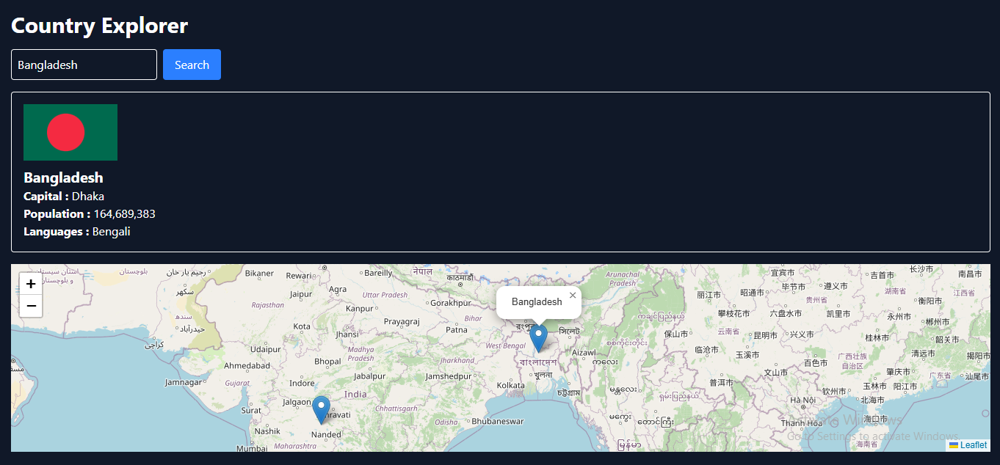

# 🌍 Country App

## 📖 About this Project
The **Country App** is a simple yet powerful web application built using **HTML, CSS, JavaScript, and Tailwind CSS**.  
This app fetches country data from a public API using the **`fetch()` method** and displays useful information such as:  
- Country name  
- Flag  
- Population  
- Region  
- Languages  
- Currencies  

## 🚀 Features
- Responsive design with Tailwind CSS  
- API integration using `fetch()`  
- Clean UI with country search functionality  
- Displays detailed information for each country  

## 🛠️ Tech Stack
- **HTML**  
- **CSS**  
- **JavaScript**  
- **Tailwind CSS**  
- **REST API** (via `fetch()`)  

## 📸 Screenshot

---
✨ Feel free to fork and explore this project!
